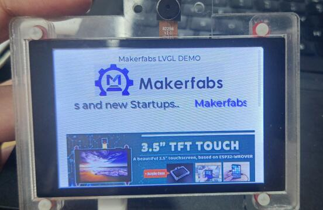

# Project ESP32 LVGL Demo


```c++
/*
Version:		V1.0
Author:			Vincent
Create Date:	2021/10/14
Note:
	
*/
```


[toc]



# Makerfabs

[Makerfabs home page](https://www.makerfabs.com/)

[Makerfabs Wiki](https://makerfabs.com/wiki/index.php?title=Main_Page)


# Project ESP32 LVGL Demo

## Intruduce


LVGL is an open-source graphics library providing everything you need to create embedded GUI with easy-to-use graphical elements, beautiful visual effects and low memory footprint.

We did a simple LVGL demo using the ESP32 3.5" Touch Camera(Capacitive).

Realized the function of text display, text scroll display, picture display and page scroll.


## Equipment list

- ESP32 Touch Camera (3.5" TFT with ILI9488 and FT6236)

Github Link : [Project_Touch-Screen-Camera](https://github.com/Makerfabs/Project_Touch-Screen-Camera)

Product link ：[ ESP32 Touch Camera(Capacitive)](https://www.makerfabs.com/esp32-3.5-inch-tft-touch-capacitive-with-camera.html) 


## Compiler Options

**If you have any questions，such as how to install the development board, how to download the code, how to install the library. Please refer to :[Makerfabs_FAQ](https://github.com/Makerfabs/Makerfabs_FAQ)**


### Install library

- Open Makerfabs_LVGL_demo.ino.

- Using library lv_arduino at version 3.0.1
- Using library TFT_eSPI at version 2.3.70
- Upload codes, select "ESP32 Wrover Module" and "Huge APP"


### Set TFT_eSPI

This demo depend on TFT_eSPI library. You must set "User_Setup.h".
Set screen type.

```c++
// Only define one driver, the other ones must be commented out
//#define ILI9341_DRIVER
//#define ST7735_DRIVER      // Define additional parameters below for this display
//#define ILI9163_DRIVER     // Define additional parameters below for this display
//#define S6D02A1_DRIVER
//#define RPI_ILI9486_DRIVER // 20MHz maximum SPI
//#define HX8357D_DRIVER
//#define ILI9481_DRIVER
//#define ILI9486_DRIVER
#define ILI9488_DRIVER     // WARNING: Do not connect ILI9488 display SDO to MISO if other devices share the SPI bus (TFT SDO does NOT tristate when CS is high)
//#define ST7789_DRIVER      // Full configuration option, define additional parameters below for this display
//#define ST7789_2_DRIVER    // Minimal configuration option, define additional parameters below for this display
```
And set pins.

```c++
// For 3.5" 9488
// The hardware SPI can be mapped to any pins

#define TFT_MISO 12
#define TFT_MOSI 13
#define TFT_SCLK 14
#define TFT_CS   15  // Chip select control pin
#define TFT_DC    33  // Data Command control pin
#define TFT_RST   26  // Reset pin (could connect to RST pin)
    

```


### Set lv_arduino

This demo also need to set lv_arduino library.

You need copy` lv_conf_template.h`  as `lv_conf.h`next to the `lv_arduino` floder.

And set 0 to 1.

```c++
/**
 * @file lv_conf.h
 * Configuration file for LVGL v7.0.2
 */

/*
 * COPY THIS FILE AS `lv_conf.h` NEXT TO the `lvgl` FOLDER
 */

#if 0 /*Set it to "1" to enable content*/

```


## Code Explain

This section describes how to use LVGL Widgets.

###  Page

The Page consist of two Containers on each other:

- a **background**
- a top which is **scrollable**.

Please refer to the detailed usage method:[widgets/page](https://docs.lvgl.io/latest/en/html/widgets/page.html)

#### Example

```c++
//File: Setup.ino

lv_obj_t *page1 = lv_page_create(NULL, NULL);
lv_page_set_scrollbar_mode(page1, LV_SCROLLBAR_MODE_DRAG);
lv_disp_load_scr(page1);
```

Create a new page and set it to scroll mode(LV_SCROLLBAR_MODE_DRAG) .


### Label

A label is the basic object type that is used to display text.

Please refer to the detailed usage method:[widgets/label](https://docs.lvgl.io/latest/en/html/widgets/label.html#overview)

#### Example 1

```c++
//File: Setup.ino

lv_obj_t *label = lv_label_create(lv_scr_act(), NULL);
lv_label_set_text(label, "Makerfabs LVGL DEMO");
lv_obj_align(label, NULL, LV_ALIGN_IN_TOP_MID, 0, 0);
```

At the top of the page, a paragraph of text is displayed in the center.

#### Example 2

```c++
//File: Setup.ino

/*Create a style for the shadow*/
static lv_style_t style_1;
lv_style_init(&style_1);
lv_style_set_text_font(&style_1, LV_STATE_DEFAULT, &lv_font_montserrat_24);

static lv_style_t style_2;
lv_style_init(&style_2);
lv_style_set_text_font(&style_2, LV_STATE_DEFAULT, &lv_font_montserrat_24);
lv_style_set_text_opa(&style_2, LV_STATE_DEFAULT, LV_STYLE_TEXT_OPA);

lv_obj_t *label1 = lv_label_create(lv_scr_act(), NULL);
lv_label_set_long_mode(label1, LV_LABEL_LONG_SROLL_CIRC); /*Circular scroll*/
lv_obj_set_width(label1, 400);
lv_obj_set_height(label1, 30);
lv_label_set_recolor(label1, true);
lv_obj_align(label1, NULL, LV_ALIGN_IN_TOP_MID, 0, 100);
lv_obj_add_style(label1, LV_BTN_PART_MAIN, &style_1);
lv_label_set_text(label1, "  #0000ff Makerfabs# is Open Hardware..."); 

lv_obj_t *label1_s = lv_label_create(lv_scr_act(), NULL);
lv_label_set_long_mode(label1_s, LV_LABEL_LONG_SROLL_CIRC); /*Circular scroll*/
lv_obj_set_width(label1_s, 400);
lv_obj_set_height(label1_s, 30);
lv_label_set_recolor(label1_s, true);
lv_obj_align(label1_s, NULL, LV_ALIGN_IN_TOP_MID, 2, 102);
lv_obj_add_style(label1_s, LV_BTN_PART_MAIN, &style_2);
lv_label_set_text(label1_s, lv_label_get_text(label1));
```

Creates a text scroll bar with a font shadow.


### Image

Images are the basic object to display from the flash (as arrays) or externally as files.

To generate a **pixel array** from a PNG, JPG or BMP image, use the [Online image converter tool](https://lvgl.io/tools/imageconverter) and set the converted image with its pointer: `lv_img_set_src(img1, &converted_img_var);` To make the variable visible in the C file, you need to declare it with `LV_IMG_DECLARE(converted_img_var)`.

Please refer to the detailed usage method:[widgets/img](https://docs.lvgl.io/latest/en/html/widgets/img.html#)

#### Example

```c++
//File: Setup.ino

extern const lv_img_dsc_t logo;
lv_obj_t *image_logo = lv_img_create(lv_scr_act(), NULL);
lv_img_set_src(image_logo, &logo);
lv_obj_align(image_logo, NULL, LV_ALIGN_IN_TOP_MID, 0, 20);

```

The image that will be converted to a C array is centered at the top of the screen.